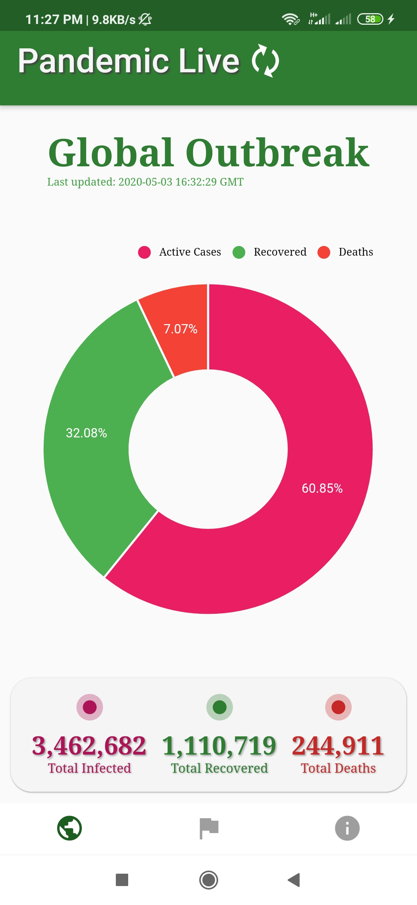
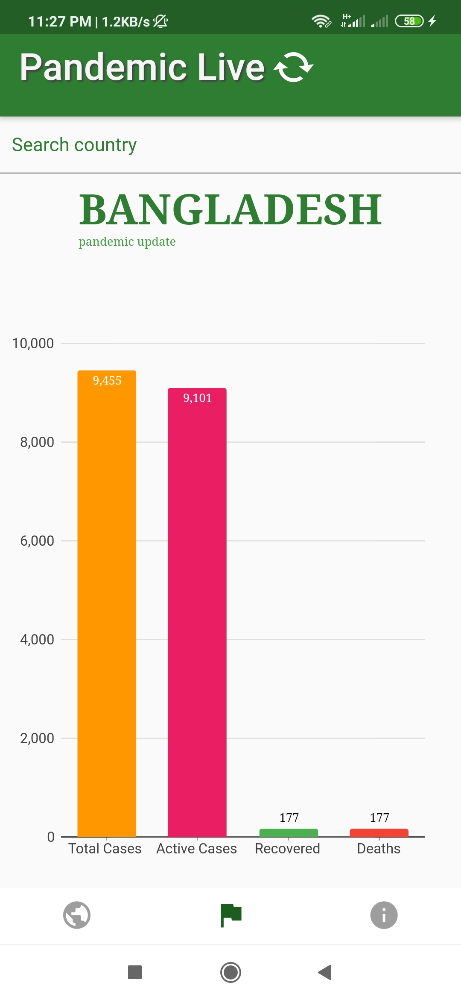

# Pandemic Live (covid19)
>This is my first flutter project. "Pandemic Live" is a free application, aimed to provide "COVID19" pandemic update. It shows global and country wise update along with analytical chart/graph and data table in real time. This app fetch data from [mathdroid's covid19-api](https://github.com/mathdroid/covid-19-api) and [covid19api.com](https://covid19api.com/). They both serve JSON data from John Hopkins University CSSE.

**NB: If you see any inconsistency in data, assume that the JHU data is under maintainance.**


## Logo


## Features
* World Data
* Country Data
* Country Search
* Trace IP address and retrieve country info


## Review
* [Review of **V1.0.0**](https://www.youtube.com/watch?v=lEmWeVygv-k) (YouTube Video)
* [Review of **V1.0.1**](https://youtu.be/jIMlt_Z3GgI) (YouTube Video)


## Download
[Download from Google Drive](https://drive.google.com/drive/u/0/folders/1hfRG94Y32CpWFMM0yBwcL6TXxUGWnC20?fbclid=IwAR0JiWiyXvmtsq5IGxOJIRsCzI3ez6_RwWYhGjLejD1SLcelplLiFiSDpAY)


## Screenshots of V1.0.1
| Global        | Country Page           |
| ------------- |:-------------:|
|       |  |


## Privacy
* [Privacy](privacy.md)


## Run the project locally

Clone the project
```bash
[user@host ~]$ git clone https://github.com/rk4bir/pandemic-live.git && cd pandemic-live
```

Install packages
```bash
[user@host pandemic-live]$ flutter pub get
```

Run on a connected android device (debug version)
```bash
[user@host pandemic-live]$ flutter run --debug
```

Run on a connected android device (release version)
```bash
[user@host pandemic-live]$ flutter run --release
```

Build for production (apk)
```bash
[user@host pandemic-live]$ flutter build apk --split-per-abi
```

Build for production (appbundle)
```bash
[user@host pandemic-live]$ flutter build appbundle --no-shrink
```
