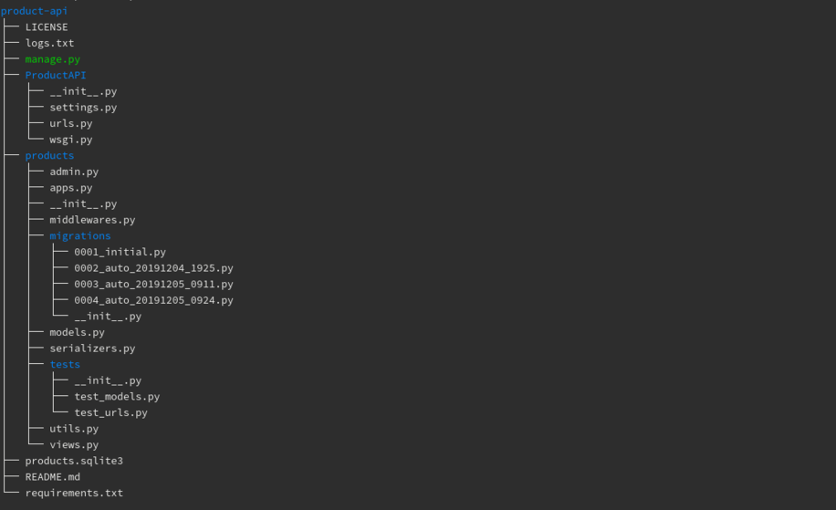

# PRODUCT-API
> A simple restful product api


## Technologies
* Linux
* Python
* Django
* Django Rest Framework
* Virtualenv
* SQLite3


## Project tree



## Features

#### API end-points
* Product list view with pagination
* Product detail view 
* Product size create view
* Product color create view
* Product price create view

#### Others
* Logging
* Unit tests


## Installation


### Create virtualenv
> The project was developed with **linux** (fedora 31), **Python v3.7.5** and **sqlite3 v3.30.0**.

First of all clone the project to your local machine
```bash
[user@machine ~]$ git clone https://github.com/rk4bir/product-api.git
```

Install virtualenv for pip3
```bash
[user@machine ~]$ pip3 install virtualenv
```

Goto product-api directory
```bash
[user@host ~]$ cd product-api/
```

Create virtual environment with `virtualenv`
```bash
[user@host product-api]$ virtualenv -p /usr/bin/python3 env
```

Now activate the environment
```bash
[user@host product-api]$ source env/bin/activate
``` 

Then install the dependencies from *requirements.txt* file
```bash
(env) [user@host product-api]$ python -m pip install -r requirements.txt
```

Sync the database
```bash
(env) [user@host product-api]$ python manage.py migrate
``` 

To add data to the database create a superuser, if you use 
given **products.sqlite3** database then the credentials are -
* username: admin
* password: admin123
```bash
(env) [user@machine product-api]$ python manage.py createsuperuser
```
This will prompt for username, email and password. Once the user is created. 

\
Test the project
```bash
(env) [user@host product-api]$ python manage.py test
``` 

\
Finally start the development server
```bash
(env) [user@host product-api]$ python manage.py runserver
``` 

Now visit api's home at [http://127.0.0.1:8000/products/](http://127.0.0.1:8000/products/)

To insert data visit [http://127.0.0.1:8000/admin/](http://127.0.0.1:8000/admin/)

